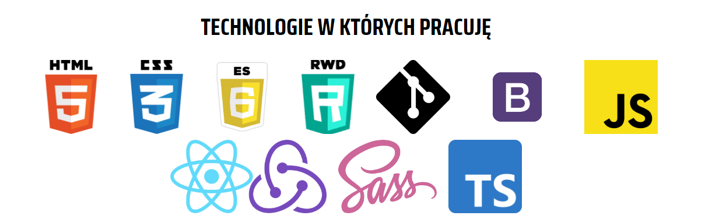

# CodersCamp 2020 - Projekt HTML & CSS

## Spis treści

* Projekt — Wizytówka / Portfolio
* Technologia projektu
* Przegląd projektu
* Dostępne skrypty
* Wersja demo

### Projekt — Wizytówka / Portfolio

Projekt powstał w ramach kursu CodersCamp 2020. Jest to pierwszy projekt
z serii projektów, które będą realizowane w tym kursie.
Ma on charakter indywidualny.
Celem projektu jest utrwalenie wiedzy dotyczącej HTML i CSS,
bez korzystania z gotowych bibliotek oraz frameworków.

### Technologia projektu

Projekt powstał w oparciu o technologie HTML i CSS.
W celu uporządkowania kodu styli, posłużono się task-runner'em Gulp, 
który umożliwił wykorzystanie preprocesora CSS.
Projekt stanowi wizytówkę, przybliżającą profil autora projektu.
Wykonanie wizytówki obejęło niżej wymienione zagadnienia, w celu ich utrwalenia:

- Box-model
- Kaskadowość CSS
- Selektory CSS
- Popularne tagi HTML
- Jak podpinać CSSa do HTMLa
- Zapisywanie kolorów
- Stylowanie tekstu
- Zewnętrzne ikony/fonty (fontawesome, google fonts)
- Flexbox
- Position (absolute, relative)
- Animacje keyframes
- Formularz (wysłanie formularza powoduje przeładowanie strony)
- Responsive Web Design

## Przegląd projektu

Pozyskanie pierwszego klienta nie przychodzi łatwo. Dla klienta,
który chce otrzymać produkt wysokiej jakości, nie jest ważna tylko firma,
która spróbuje zrealizować jego wizję. Równie istotne jest też to, z 
jakimi konkretnymi osobami przyjdzie mu współpracować przy wytwarzaniu
oprogramowania. 

Wizytówka jest bardzo dobrym rozwiązaniem, jeśli chodzi o przedstawienie 
swojego profilu potencjalnemu klientowi. Dlatego właśnie powstał projekt 
portfolio.

Na początku strony widnieje header, który przedstawia krótko informację o tym,
czym się potencjalny współpracownik zajmuje, oraz jak wygląda na zdjęciu.
Jeżeli profil będzie interesujący, a potencjalny klient zainteresowany usługą,
 wówczas na pewno sprawdzi co go czeka na dalszej części strony.
  
   

Wizytówka zawarła informację o celach zawodowych autora, technologiach w których
autor pracuje. Istotną część wizytówki stanowi krótkie przedstawienie
zrealizowanych dotychczasowo projektów.

  
    
Wizytówka odkrywa również prywatną sferę ukazując jakie motto prowadzi autora
projektu, oraz co lubi robić w wolnym czasie.
Na końcu strony, standardowo znajduje się formularz kontaktowy wraz z 
danymi kontaktowymi oraz stopka.

Formularz nie został obsłużony i powoduje przeładowanie strony.
Zachowanie takie występuje ze względu na cel projektu.

## Dostępne skrypty

Po sklonowaniu bieżącego projektu pamiętaj, aby 
uruchomić `npm install`, aby zainstalować wszystkie zależności.

#### Uruchomienie projektu
Projekt możesz uruchomić za pomocą komendy:

```npm start```

Otwórz adres [http://localhost:3000](http://localhost:3000), aby wyświetlić go w przeglądarce.

## Wersja demo

Wersja demo powstała przy pomocy GitHub Pages.
Jeżeli chcesz zobaczyć wersję demo kliknij 
w [>>link<<](https://s-justina.github.io/CodersCamp2020.Project.HTML-CSS.BusinessCard/).